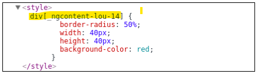

# Fortgeschrittene Komponentenkonzepte

## Styling von Angular-Komponenten

### ViewEncapsulation – Strategien zum Kapseln Ihrer Styles

Der Schlüssel zur Kapselung der Styles liegt in den von Angular bereitgestellten View-Encapsulation-Strategien. Diese Strategien werden am @Component-Decorator definiert und legen fest, inwiefern das implementierte CSS für die Komponente gekapselt werden soll. Insgesamt bietet das Framework Ihnen drei Optionen zur Auswahl:

- **ViewEncapsulation.Emulated:** Die Style-Kapselung wird durch Angular emuliert. (Dies ist der Standardwert.)
- **ViewEncapsulation.None:** Es findet keine Kapselung der hinterlegten Styles statt.
- **ViewEncapsulation.ShadowDom:** Die Kapselung erfolgt über den nativen WebComponents-Shadow-DOM-Mechanismus.

```ts
import {Component, ViewEncapsulation } from '@angular/core';
@Component({
  ...
  encapsulation: ViewEncapsulation.ShadowDom
})
export class MyComponent {
  ...
}
```

#### Der Standardfall: ViewEncapsulation.Emulated

Diese Strategie sorgt, dafür, dass Angular die Kapselung der Styles für den Browser emuliert. Dies passiert, indem Angular den Tags noch ein Attribut hinzufügt, was diese eindeutig identifiziert.

Der Selektor trifft somit nur noch auf div-Tags zu, die zusätzlich das Attribut \_ngcontent-lou-14 besitzen.

#### CSS-Kapselung abschalten: ViewEncapsulation.None

In gewissen Fällen ist es sinnvoll, die Kapselung von CSS-Styles abzuschalten. Ein typisches Beispiel hierfür ist die Implementierung von Container-Komponenten. Stellen Sie sich beispielsweise vor, Sie wollten eine speziell gestylte Dialog-Komponente entwerfen. Der Benutzer Ihrer Komponente soll ebenfalls die von Ihnen bereit gestellten Klassen verwenden können, um dort beispielsweise passend gestaltete Buttons zu platzieren. Die Benutzung dieser Komponente könnte etwa wie folgt aussehen:

```html
<ch-styled-dialog title="Wollen Sie Ihre Styles kapseln?">
  <button class="ch-styled-dialog-button">Ja</button>
  <button class="ch-styled-dialog-button">Nein</button>
</ch-styled-dialog>
```

Mit der Standardstrategie _Emulated_ wären die für den _StyledDialog_ definierten CSS-Regeln im Body der Komponente aber überhaupt nicht sichtbar.

#### Vollständige Kapselung: ViewEncapsulation.ShadowDom

Diese Strategie verlässt sich auf den nativen Kapselmechanismus des verwendeten Renderers. Bei der Implementierung einer regulären Webanwendung auf Basis des DOMs bedeutet dies, dass das Shadow-DOM verwendet wird – eine Funktionalität aus dem WebComponents-Standard. Die Grundidee hinter der Shadow-DOM-Technik besteht vereinfacht ausgedrückt darin, bestimmte Teile des DOM-Baums vor der restlichen Applikation »zu verstecken«. So ist die interne Implementierung einer Komponente im Optimalfall völlig irrelevant für die verwendende Anwendung und sollte somit auch nicht für diese sichtbar (und veränderbar) sein. Diese Anforderung löst die Shadow-DOM-Technik dadurch, dass genau solche internen Implementierungsdetails innerhalb eines sogenannten shadow-root Knotens in die Applikation eingehängt werden. Auf alle Elemente innerhalb dieses Knotens kann nun nicht mehr von außen zugegriffen werden; sie können also z. B. nicht mithilfe eines querySelector-Aufrufs über die DOM-API selektiert werden. Des Weiteren garantiert das Shadow-DOM, dass keine CSS-Regeln, die innerhalb des shadow-root-Knotens definiert wurden, außerhalb des Knotens sichtbar sind und dass keine Regeln, die außerhalb definiert wurden, Auswirkungen auf das Styling der Komponente haben. Während globale Styles bei der ViewEncapsulation.Emulated-Strategie in der Komponente sichtbar sind, bleiben sie bei der ViewEncapsulation.ShadowDom-Strategie ohne Effekt. Bsp.

```html
<div class="timepicker">
  <div class="col">
    <button (click)="incrementTime('hours')">+</button>
    <input [value]="time?.hours" ... />
    <button (click)="decrementTime('hours')">-</button>
  </div>
  ...
</div>
```

Durch die ViewEncapsulation.Emulated-Kapselung bleiben die für diese Klasse definierten Styles zwar ohne Auswirkung auf die restliche Anwendung; wenn allerdings in einem globalen CSS-Stylesheet ebenfalls ein Selektor für die Klasse col definiert wurde, werden diese Styles nun zusätzlich auf das div-Tag angewendet.

## TemplateRef und NgTemplateOutlet: dynamisches Austauschen von Komponenten-Templates

Durch selbst definierte Template-Referenzen können Sie Entwicklern, die Ihre Komponenten-Bibliothek verwenden, die Möglichkeit geben, Teile der Komponenten-View auszutauschen und durch eigene Templates zu ersetzen.

### NgFor mit angepassten Templates verwenden

Ausgangspunkt:

```html
<h2>Blogeinträge</h2>
<ch-blog-list [entries]="entries"></ch-blog-list>
```

Verwendung der »BlogListComponent« mit eigenem Template:

```html
<ch-blog-list [entries]="entries">
  <ng-template let-entry>
    <div class="entry-minimal">
      <div class="summary-image">
        
      </div>
      <div class="summary-title">
        <span>{{entry?.title}}</span>
      </div>
    </div>
  </ng-template>
</ch-blog-list>
```

Die Idee dahinter lautet wie folgt: »Wird kein eigenes Template mitgeliefert, soll die Standardansicht zum Rendern der Einträge verwendet werden. Wird ein Template mitgeliefert, soll dieses zur Darstellung herangezogen werden.«

Um zugriff auf das Template zu bekommen stellt Angular die TemplateRef-Klasse bereit. In Verbindung mit dem @ContenChild-Decorator können Sie so leicht in Ihrer Anwendungslogik auf das Template zugreifen:

```ts
@Component({
  selector: 'ch-blog-list',
  ...
})

export class BlogListComponent {
  @Input() entries: any[];
  @ContentChild(TemplateRef) entryTemplate: TemplateRef<any>;
  hasCustomTemplate: boolean;
  ngAfterContentInit() {
    this.hasCustomTemplate = this.entryTemplate != null;
  }
  ...
}
```

Ist ein eigenes Template definiert, so können Sie nun im HTML-Code über die entryTemplate-Variable darauf zugreifen. Zur leichteren Behandlung der beiden Fälle wird innerhalb des ngAfterContentInit-Callbacks außerdem noch die Hilfsvariable hasCustomTemplate definiert.

```html
<div *ngIf="!hasCustomTemplate">
  <ch-blog-entry [entry]="entry" *ngFor="let entry of entries"> </ch-blog-entry>
</div>
<div *ngIf="hasCustomTemplate">
  <ng-template ngFor [ngForOf]="entries" [ngForTemplate]="entryTemplate">
  </ng-template>
</div>
```

Wobei

```html
<ch-blog-entry [entry]="entry" *ngFor="let entry of entries"> </ch-blog-entry>
```

nur eine Kurzschreibweise von

```html
<ng-template ngFor let-entry [ngForOf]="entries">
  <ch-blog-entry [entry]="entry"></ch-blog-entry>
</ng-template>
```

ist.
Zusätzlich hierzu bietet die NgFor-Direktive Ihnen aber außerdem die Möglichkeit, über das ngForTemplate-Input-Binding ein zu renderndes Template an die Direktive zu übergeben. Über den Code

```html
<ng-template ngFor [ngForOf]="entries" [ngForTemplate]="entryTemplate">
</ng-template>
```

teilen Sie _NgFor_ somit mit, dass Sie für jedes Element der Schleife das _entryTemplate_ rendern möchten. Eine etwas eigenwillige Besonderheit besteht zusätzlich darin, dass die Zählvariable let-entry in diesem Fall nicht im umschließenden template-Tag, sondern bei der Implementierung des entryTemplate definiert wird:

```html
<ch-blog-list [entries]="entries">
  <ng-template let-entry>
    <div class="entry-summary">...</div>
  </ng-template>
</ch-blog-list>
```

### NgTemplateOutlet: zusätzliche Templates an die Komponente übergeben

Wenn Sie Templates außerhalb von Schleifen austauschen wollen, dann gibt es die _NgTemplateOutlet-Direktive_. Möchten Sie den Nutzern Ihrer BlogListComponent beispielsweise die Möglichkeit geben, zusätzliches Markup einzufügen (zum Beispiel zur Personalisierung der Komponente), so können Sie dies mithilfe der NgTemplateOutlet-Direktive wie folgt realisieren:

```html
...blog-list.component.html
<ng-template [ngTemplateOutlet]="additionalMarkup"></ng-template>
```

Bei der additionalMarkup-Variablen handelt es sich – genau wie bei der entryTemplate-Variablen – um ein TemplateRef-Objekt. Innerhalb Ihrer Komponente benötigen Sie nun also die Möglichkeit, zwei Template-Referenzen zu übergeben.

```html
<ch-blog-list [entries]="entries">
  <ng-template let-entry #entryTemplate>
    <div class="entry-summary">...</div>
  </ng-template>
  <ng-template #additionalMarkup>
    <div>Insgesamt: {{entries.length}} Einträge</div>
  </ng-template>
</ch-blog-list>
```

Durch die Definition der beiden lokalen Variablen _entryTemplate_ und _additionalMarkup_ haben sie die Möglichkeit diese Templates gezielt zu injizieren.

```ts
...blog-list.component.ts
export class BlogListComponent {
  @Input() entries: any[];
  @ContentChild("entryTemplate") entryTemplate: TemplateRef;
  @ContentChild("additionalMarkup") additionalMarkup: TemplateRef;
  hasCustomTemplate: boolean;
  ngAfterContentInit() {
    this.hasCustomTemplate = this.entryTemplate != null;
  }
}
```

```html
...blog-form.component.html
<ng-template [ngTemplateOutlet]="customTemplate"></ng-template>
```

## ViewContainerRef und ComponentFactory: Komponenten zur Laufzeit hinzufügen

Möchten Sie erst zur Laufzeit entscheiden, welche Komponente in einen Baum eingefügt werden soll, stößt der statische Ansatz an seine Grenzen. Mit den Klassen _ViewContainerRef_ und _ComponentFactory_ bietet Angular Ihnen jedoch zusätzlich die Möglichkeit, Komponenten zur Laufzeit der Anwendung zu einem Template hinzuzufügen.

### ViewContainerRef und entryComponents: Komponenten zur Laufzeit hinzufügen

Möchten sie einen Kreis:

```ts
@Component({
  selector: 'ch-circle',
  template: `<div [ngStyle]="{'background-color' : color}"></div>`,
  styles: [...]
})
export class CircleComponent {
  @Input() color = 'black';
}
```

dynamisch zu euer existierenden Komponente bzw. zu deren Template hinzufügen, benötigen Sie zunächst einmal einen >>Ort<< im Template (de sogenannte _ViewContainer_), an dem die Komponente(n) eingefügt werden soll(en). Hierfür erstellen sie ein beliebiges DOM-Element und machen Sie dieses mithilfe einer lokalen Variable (hier container) selektierbar:

```html
<div class="element-container" #container></div>
```

Sie gesamte Implementierung zur dynamischen Erzeugung von zwei Kreis-Komponenten sie wie folgt aus:

```ts
export class DynamicComponentsDemoComponent implements AfterViewInit {
  @ViewChild("container", { read: ViewContainerRef }) container;
  circleFactory: ComponentFactory<CircleComponent>;
  constructor(private resolver: ComponentFactoryResolver) {
    this.circleFactory = this.resolver.resolveComponentFactory(CircleComponent);
  }
  ngAfterViewInit() {
    this.container.createComponent(this.circleFactory); // Kreis 1
    this.container.createComponent(this.circleFactory); // Kreis 2
  }
}
```

Aus Performancegründen entfernt Angular Komponenten, welche zum Compilevorgang nicht benötigt werden. Um Angular also zu sagen, dass die Circle Komponente doch benötigt wird, muss diese im Decorator über das _entryComponents_ Array bekannt gemacht werden.

```ts
@NgModule({
  imports: [BrowserModule, FormsModule],
  bootstrap: [AppComponent],
  entryComponents: [CircleComponent],
  declarations: [ ... ]
})
export class AppModule {}
```

### ComponentRef: Interaktion mit der dynamisch erzeugten Komponente

Um nach der erstellung noch mit dieser Komponente interagieren zu können, gibt die Methode _createComponent_ ihnen als Rückgabewert eine Referenz auf die erstellte Komponente über die Klasse _ComponentRef_. Über deren Eigenschaft _instance_ haben Sie anschließend Zugriff auf die erzeugte Komponenten-Instanz. Möchten Sie beispielsweise das Input-Binding color nach der Erzeugung der Komponente verändern, so können Sie dies wie folgt erreichen:

```ts
export class DynamicComponentsDemoComponent implements AfterViewInit {
...
  addCircle(color: string) {
    const circleRef = this.container.createComponent(this.circleFactory);
    circleRef.instance.color = color;
  }
}
```

### Komponenten an einer bestimmten Stelle einfügen

Ohne weitere Parameter hängt die createComponent-Methode neu erzeugte Komponenten immer ans Ende an. Über einen zusätzlichen Parameter haben Sie die Möglichkeit, den Index zu bestimmen, an dem die Komponente eingefügt werden soll.

```ts
addCircle(color: string) {
  const circleRef = this.container.createComponent(this.circleFactory, 0);
  circleRef.instance.color = color;
  return circleRef;
}
```

### Komponenten innerhalb des ViewContainers verschieben und löschen

Um Komponenten zu verschieben, können Sie sich über die _ViewContainerRef_-Methode _get_ zunächst Zugriff auf die Komponente verschaffen, die sich an einer bestimmten Stelle im Container befindet. Über die Methode _move_ können Sie die Komponente anschließend an einen beliebigen Index verschieben. Beide Methoden arbeiten dabei mit Instanzen der Klasse _ViewContainerRef_:

```ts
moveCircle(oldIndex, newIndex) {
  const viewRef = this.container.get(oldIndex);
  this.container.move(viewRef, newIndex)
}
```

Die _ViewContainerRef_ erhält man zudem auch über die Eigenschaft _hostView_ der Klasse _ComponentRef_

```ts
ngAfterViewInit(){
  ...
  const circleRef = this.addCircle('gray');
  this.container.move(circleRef.hostView, 1);
}
```

Zu guter Letzt bietet Ihnen die Klasse _ViewContainerRef_ mit der remove-Methode die Möglichkeit, Komponenten über ihren Index aus dem DOM-Baum zu entfernen.

```ts
this.container.remove(this.container.length - 1); // entfernt den letzten Kreis
```

### createEmbeddedView: Templates dynamisch einbinden

Neben dem Hinzufügen von Komponenten-Instanzen bietet Ihnen die Klasse _ViewContainerRef_ über die _createEmbeddedView_-Methode außerdem die Möglichkeit, Template-Referenzen zur Laufzeit zu Ihrer View hinzuzufügen. So können Sie über diese Technik leicht eigene _strukturelle Direktiven_ erstellen, also Direktiven, die zur Laufzeit neue DOM-Knoten erzeugen.

#### Die Repeater-Direktive

Möchten Sie beispielsweise eine Repeater-Direktive implementieren, die ein Template mehrfach darstellt, so tun Sie dies mithilfe von createEmbeddedView wie folgt:

```ts
@Directive({
  selector: "[chRepeater]",
})
export class RepeaterDirective {
  constructor(
    private container: ViewContainerRef,
    private template: TemplateRef<any>
  ) {}
  @Input("chRepeater") set repeatIt(count: number) {
    this.container.clear();
    for (let i = 0; i < count; i++) {
      this.container.createEmbeddedView(this.template);
    }
  }
}
```

Die Direktive erwartet durch diese Implementierung, dass sie direkt auf einem _ng-template_-Element eingesetzt wird.

```html
<input type="number" [(ngModel)]="repeatCnt" /> <br /><br />
<ng-template [chRepeater]="repeatCnt">
  <div>
    <i>Ich werde wiederholt!</i>
  </div>
</ng-template>
```

Sie haben – ohne es gemerkt zu haben – soeben Ihre erste strukturelle, Microsyntax-kompatible Direktive entwickelt. Diese kann nun so abgekürzt werden:

```html
<div *chRepeater="repeatCnt">
  <i>Ich werde wiederholt!</i>
</div>
```

#### Der Template-Kontext: Übergabe von Parametern an dynamisch erzeugte Templates

In manchen Fällen kann es des Weiteren notwendig sein, Parameter an ein dynamisch erzeugtes Template zu übergeben. Da reine Template-Elemente allerdings keine Input-Bindings oder Ähnliches unterstützen, müssen Sie hier eine etwas eigenwillige Schreibweise verwenden. Diesen Eingangsparameter kann man mit der _let_-Schreibweise definieren.

```html
<ng-template #todoTemplate let-todo="todoParam">
  <div [ngStyle]="{'text-decoration': todo.done ? 'line-through' : ''}">
    <b>{{todo.text}}</b>
  </div>
</ng-template>
```

Im Zusammenspiel mit der createEmbeddedView-Methode benötigen Sie nun aber noch eine Möglichkeit, diesen Eingangsparameter dynamisch zu beschreiben. Dazu können Sie in der Methode über einen zweiten Parameter den sogenannten Template-Kontext definieren. Möchten Sie beispielsweise ein dynamisch erzeugtes Todo-Template befüllen, so können Sie dies wie folgt implementieren:

```ts
export class DynamicComponentsDemoComponent {
  @ViewChild("todoContainer", { read: ViewContainerRef }) todoContainer;
  @ViewChild("todoTemplate") todoTemplate;
  ...
  ngAfterContentInit() {
    this.todoContainer.createEmbeddedView(this.todoTemplate, {
      todoParam: {
        text: "Aufräumen",
        done: true,
      },
    });
  }
}
```

## NgComponentOutlet: dynamisch erzeugte Komponenten noch einfacher verwalten

Mit der _NgComponentOutlet_-Direktive bietet Angular Ihnen seit Angular 4 eine etwas einfachere Alternative für diesen Anwendungsfall. Möchten Sie beispielsweise die _CircleComponent_ wie im vorigen Abschnitt dynamisch an eine Stelle im DOM-Baum einfügen, so können Sie dies mithilfe der _NgComponentOutlet_-Direktive wie folgt erreichen:

```ts
export class DynamicComponentsDemoComponent {
  circleComponent = CircleComponent;
  ...
}
```

```html
<div *ngComponentOutlet="circleComponent"></div>
```

Falls sie die Komponente jetzt während der Laufzeit verändern wollen, können Sie das wie folgt machen:

```ts
export class DynamicComponentsDemoComponent {
  geoComponent: any = CircleComponent;
  toggleGeoComponent() {
    this.geoComponent =
      this.geoComponent === CircleComponent ? SquareComponent : CircleComponent;
  }
}
```

```html
<div *ngComponentOutlet="geoComponent"></div>
<button class="btn" (click)="toggleGeoComponent()">
  Geo-Komponente umschalten
</button>
```

### Übergabe von dynamischen Eigenschaften an NgComponentOutlet
