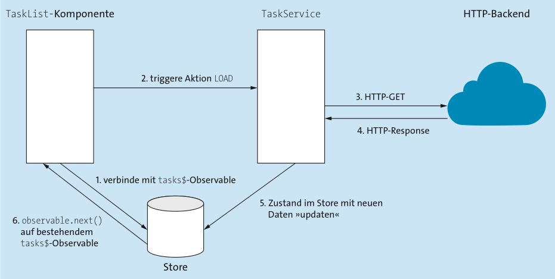

# Reaktive Architekturen mit RxJS

## Kurzeinführung in RxJS

### Observable.create und Observer-Functions – die Kernelemente der reaktiven Programmierung

Der einfachste Weg, ein Observable zu erzeugen, besteht in der Verwendung der create-Methode. Diese Methode nimmt als Parameter eine Funktion entgegen, mit deren Hilfe Sie Daten an den sogenannten Observer – also den Datenkonsumenten – senden können.

```ts
const observable = Observable.create((observer: Observer<number>) => {
  observer.next(1);
  observer.next(2);
  observer.next(3);
  observer.complete();
});

observable.subscribe(
  (value) => {
    console.log("new value: ", value);
  },
  (error) => {
    console.log("error: ", error);
  },
  () => {
    console.log("completed successfully");
  }
);
```

### Subscriptions und Disposing-Functions – Observables sauber beenden

Gerade bei »unendlich« lange laufenden Observables sollten Sie allerdings dafür sorgen, dass Sie sich manuell vom Observable abmelden, wenn Sie nicht mehr an dessen Daten interessiert sind. Die subscribe-Methode liefert Ihnen für diesen Zweck ein Objekt der Klasse Subscription zurück. Eine Abmeldung kann anschließend durch den Aufruf der unsubscribe-Funktion auf dieser Subscription erfolgen.

```ts
import {Observable, Subscription, timer} from 'rxjs';
...
export class RxDemoComponent {
  dateSubscription: Subscription;
  currentDate: Date;

  ngOnInit() {
    this.dateSubscription = timer(0, 1000)
      .pipe(map(() => new Date()))
      .subscribe(value => {
        this.currentDate = value;
      });
  }

  ngOnDestroy() {
    this.dateSubscription.unsubscribe();
  }
}
```

#### Subscriptions und die AsyncPipe

Mittels der AsyncPipe muss Sie sich keine Gedanken über die manuelle Abmeldung von einem Observable machen.

```ts
...rxdemo.component.ts
currentTime$: Observable<Date>;

ngOnInit() {
  this.currentTime$ = timer(0, 1000).pipe(map(() => new Date()));
}
...rxdemo.component.html
Aktuelle Uhrzeit: {{currentTime$ | async | date:"HH:mm:ss"}}
```

#### Disposing Functions: Eigene Observables sauber beenden

Möchten Sie in Ihren selbst implementierten Observables auf den Aufruf der unsubscribe-Funktion reagieren, so können Sie dies durch die Rückgabe einer sogenannten Disposing Function aus der create-Methode heraus tun.

```ts
randomValues = Observable.create((observer) => {
  const interval = setInterval(() => {
    observer.next(Math.random());
  }, 1000);

  return () => {
    clearInterval(interval);
  };
});
```

### Subjects: Multicast-Funktionalität auf Basis von RxJS

Bei Subjects handelt es sich um eine spezielle Form von Observables, die es Ihnen ermöglicht, auf sehr elegante Art und Weise Publish-Subscribe-Funktionalität zu implementieren. Subjects unterscheiden sich dabei im Wesentlichen durch zwei grundlegende Punkte von einfachen Observables:

1. Ein Subject kann mehrere Subscriber besitzen: Während der Aufruf der subscribe-Funktion an einem regulären Observable immer dazu führt, dass der Subscriber einen eigenen Ausführungskontext erhält, teilen sich bei einem Subject alle Subscriber die gleiche Ausführung.
2. Ein Subject ist immer gleichzeitig auch ein Datenproduzent: Im Gegensatz zu anderen Observables besitzen Subjects selbst die Methoden next, error und complete. Sie sind somit gleichzeitig Observable und Observer.

```ts
this.randomValuesSubject = new Subject();
const interval = setInterval(() => {
  this.randomValuesSubject.next(Math.random());
}, 1000);

this.sub1 = this.randomValuesSubject.subscribe((value) => {
  console.log(`Subscription 1: ${value}`);
});

this.sub2 = this.randomValuesSubject.subscribe((value) => {
  console.log(`Subscription 2: ${value}`);
});
```

```txt
Subscription 1: 0.18943417481883795
Subscription 2: 0.18943417481883795
Subscription 1: 0.7449478603959496
Subscription 2: 0.7449478603959496
Subscription 1: 0.6799151167214585
Subscription 2: 0.6799151167214585
```

## Implementierung einer Typeahead-Suche

Implementierung der Typeahead-Suche. Anfrage wird erst ausgeführt, wenn sich der Eingabewert 400 ms nicht ändert und wenn er anderst alls der vorherige war.

```ts
...task-list.component.html
<input type="text" [formControl]="searchTerm" />
<p>Search Term: {{ searchTerm.value }}</p>

...task-list.component.ts
export class AppComponent implements OnInit {
  public searchTerm = new FormControl();
  tasks$: Observable<Task[]>;


  ngOnInit() {
    this.tasks$ = this.searchTerm.valueChanges
      .pipe(
        debounceTime(400),
        distinctUntilChanged(),
        switchMap(query => this.taskService.findTasks(query))
      )
  }
}
```

Neue tasks sollen auch dann geladen werden, wenn sich der url search string verändert. Um weiterhin nur einen >>Single source of truth<< zu haben, sollten man alle Datenströme die ein erneutes laden Triggern zusammenführen.

```ts
...task-list.component.html
<input type="text" [formControl]="searchTerm" />
<p>Search Term: {{ searchTerm.value }}</p>

...task-list.component.ts
export class AppComponent implements OnInit {
  public searchTerm = new FormControl();
  tasks$: Observable<Task[]>;


  ngOnInit() {
    const paramsStream = this.route.queryParams.pipe(
      map((params) => decodeURI(params["query"] || "")),
      tap((query) => this.searchTerm.setValue(query))
    );

    const searchTermStream = this.searchTerm.valueChanges.pipe(
      debounceTime(400),
      tap((query) => this.adjustBrowserUrl(query))
    );

    this.tasks$ = merge(paramsStream, searchTermStream)
      .pipe(
        distinctUntilChanged(),
        switchMap((query) => this.taskService.findTasks(query))
      )
  }
}
```

## Reaktive Datenarchitekturen in Angular-Applikationen



```ts
export const LOAD = "LOAD";
export const ADD = "ADD";
export const EDIT = "EDIT";
export const REMOVE = "REMOVE";

@Injectable({
  providedIn: "root",
})
export class TaskStore {
  private tasks: Task[] = [];
  items$ = new BehaviorSubject<Task[]>([]);

  dispatch(action) {
    this.tasks = this.reduce(this.tasks, action);
    this.items$.next(this.tasks);
  }

  private reduce(tasks: Task[], action) {
    switch (action.type) {
      case LOAD:
        return [...action.data];
      case ADD:
        return [...tasks, action.data];
      case EDIT:
        return tasks.map((task) => {
          const editedTask = action.data;
          if (task.id !== editedTask.id) {
            return task;
          }
          return editedTask;
        });
      case REMOVE:
        return tasks.filter((task) => task.id !== action.data.id);
      default:
        return tasks;
    }
  }
}
```

## Anbindung von Websockets zur Implementierung einer Echtzeitanwendung

Eine sehr einfache Umsetzung der Websocket-Logik

```ts
const io = require("socket.io")(3001);
const _socketMap = {};

io.on("connection", (socket) => {
  _socketMap[socket.id] = socket;

  socket.on("broadcast_task", (data) => {
    for (const socketKey in _socketMap) {
      const broadcastTo = _socketMap[socketKey];
      if (socket.id !== broadcastTo.id) {
        broadcastTo.emit("task_saved", data);
      }
    }
  });
});
```

Um socket.io in Angular verwenden zu können muss man folgendes installieren:

```sh
npm install socket.io-client
npm install @types/socket.io-client --save-dev # TypeScript-Typdefinitionsdateien
```
